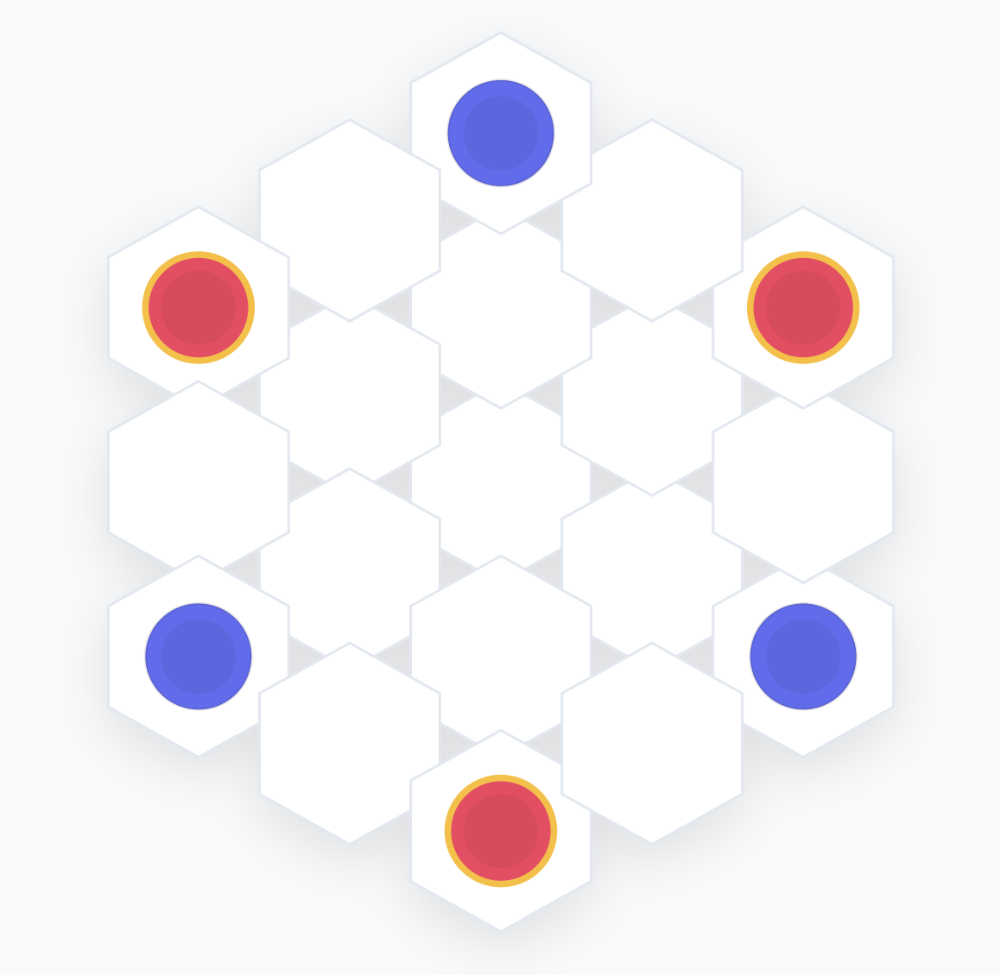
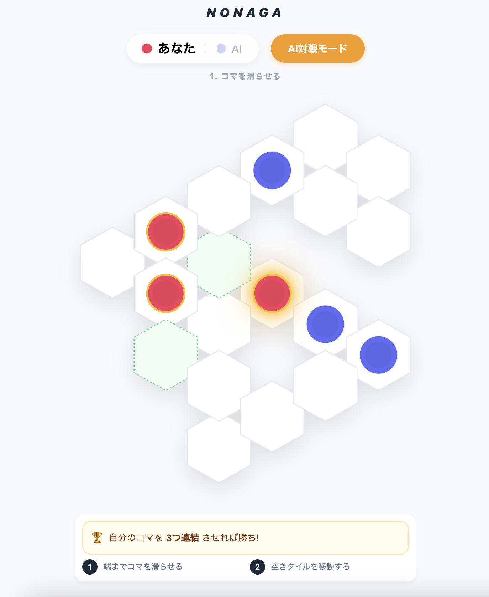

<div align="center">
  
  <h1>NONAGA（ノナガ）</h1>
  <p><strong>盤面を動かす、新感覚の六角形ストラテジーボードゲーム</strong></p>

  [](LICENSE)
  [](https://nextjs.org/)
  [](https://react.dev/)
  [](https://www.typescriptlang.org/)
  [](https://aws.amazon.com/)

  <a href="https://hexlide.riverapp.jp">
    
  </a>
</div>

---

## 📖 プロジェクト概要

**NONAGA（ノナガ）**は、従来のボードゲームにない独自の戦術性を持つ六角形グリッドの対戦ゲームです。コマだけでなく**盤面のタイル自体を動かす**ことができる革新的なルールにより、無限の戦略的可能性が広がります。

### ゲームルール

1. **目的**: 自分の3つのコマを隣接させる（2つ以上のペアが隣接）
2. **ターン制**: 各ターンで「コマ移動」→「タイル移動」の2アクション
3. **スライド移動**: コマは6方向に直線スライドし、障害物にぶつかるまで進む
4. **タイル移動**: タイルを動かして盤面を変形（連結性を保つ必要あり）

シンプルなルールながら、読み合いと戦術の深さを兼ね備えた中毒性の高いゲーム体験を提供します。



---

## ✨ 主要機能

### 🎯 3つのゲームモード

| モード | 説明 | URL |
|--------|------|-----|
| **ローカルAI対戦** | 位置評価AIとの1人プレイ | [プレイ](https://hexlide.riverapp.jp/) |
| **ローカル2人対戦** | 同じデバイスで2人プレイ | [プレイ](https://hexlide.riverapp.jp/) |
| **オンライン対戦** | 6桁ルームコードで友達と対戦 | [ロビー](https://hexlide.riverapp.jp/online) |

### 🌟 特徴

- 🎮 **独自のゲームメカニクス**: 盤面タイルを動かす画期的なルール
- 🧠 **戦略的深さ**: 六角座標の6方向スライド移動による読み合い
- 🤖 **AI対戦**: 位置評価スコアリング方式のAI実装
- 🌐 **オンライン対戦**:
  - 6桁ルームコードによる簡単マッチング
  - リアルタイム同期（1秒ポーリング）
  - リマッチ機能
- 📱 **フルレスポンシブ**: PC・タブレット・スマホ対応
- 🌍 **多言語対応**: 日本語・英語切り替え
- ⚡ **高速**: Next.js 15のApp Routerによる最適化
- 🎨 **美しいUI**: SVGベースのスムーズなアニメーション

---

## 🏗️ アーキテクチャ

### システム構成

```
┌─────────────┐
│   Browser   │
│ (React 19)  │
└──────┬──────┘
       │ HTTPS
       ↓
┌──────────────────┐
│  AWS Amplify     │
│  (Next.js 15)    │
└──────┬───────────┘
       │ GraphQL
       ↓
┌──────────────────┐      ┌──────────────┐
│  AWS AppSync     │─────→│ AWS Lambda   │
│  (API Gateway)   │      │ (Game Logic) │
└──────┬───────────┘      └──────┬───────┘
       │                         │
       ↓                         ↓
┌──────────────────────────────────┐
│       Amazon DynamoDB            │
│  (Game Sessions, TTL 24h)        │
└──────────────────────────────────┘
```

### 技術スタック

#### フロントエンド
- **Framework**: Next.js 15 (App Router, Standalone Output)
- **UI Library**: React 19
- **Language**: TypeScript 5.7
- **Styling**: CSS3, SVG
- **State Management**: React Hooks
- **Rendering**: SVG-based hexagonal grid

#### バックエンド
- **API**: AWS AppSync (GraphQL)
- **Compute**: AWS Lambda (Node.js 20, esbuild)
- **Database**: Amazon DynamoDB (PAY_PER_REQUEST)
- **Authentication**: API Key (Server-side only)
- **Real-time**: 1-second HTTP polling

#### インフラ
- **IaC**: AWS CDK (TypeScript)
- **Hosting**: AWS Amplify
- **CI/CD**: GitHub Actions (OIDC)
- **Monitoring**: CloudWatch, X-Ray

#### レガシー版（バニラ）
- **Technology**: HTML + React 18 (CDN) + Babel Standalone
- **Deployment**: Static hosting
- **Features**: AI対戦、2人対戦

詳細は **[技術ドキュメント](./docs/)** を参照してください。

---

## 🚀 クイックスタート

### 前提条件

- Node.js 20以上
- npm または yarn

### ローカル開発（オンライン版）

```bash
# リポジトリクローン
git clone https://github.com/Yuuga2001/nonaga.git
cd nonaga/online

# 依存関係インストール
npm install

# 環境変数設定
cat > .env.local <<EOF
APPSYNC_ENDPOINT=https://your-appsync-endpoint.appsync-api.ap-northeast-1.amazonaws.com/graphql
APPSYNC_API_KEY=da2-xxxxxxxxxxxxxxxxxxxx
EOF

# 開発サーバー起動
npm run dev
```

ブラウザで以下にアクセス:
- ローカル対戦: http://localhost:3000/
- オンラインロビー: http://localhost:3000/online

### ローカル版（バニラ）の起動

```bash
# リポジトリルートで
npx serve .
# または
python3 -m http.server 8000
```

ブラウザで http://localhost:3000 または http://localhost:8000 にアクセス。

---

## 📁 プロジェクト構造

```
nonaga/
├── docs/                       # 📚 技術ドキュメント（6分割）
│   ├── README.md               #    ドキュメント全体ガイド
│   ├── ARCHITECTURE.md         #    システム設計・データモデル
│   ├── INFRASTRUCTURE.md       #    AWSインフラ詳細
│   ├── GAME_LOGIC.md          #    ゲームアルゴリズム
│   ├── API_REFERENCE.md       #    API仕様
│   ├── DEPLOYMENT.md          #    デプロイ手順
│   └── OPERATIONS.md          #    運用・監視
│
├── online/                    # 🌐 オンライン版（Next.js）
│   ├── app/
│   │   ├── page.tsx           #    Root: ローカル対戦
│   │   ├── online/page.tsx    #    オンラインロビー
│   │   ├── game/[gameId]/     #    オンライン対戦
│   │   ├── local/             #    ローカル対戦（後方互換）
│   │   └── api/game/          #    Next.js API Routes
│   ├── components/
│   │   ├── GameClient.tsx     #    オンライン対戦UI (~700行)
│   │   ├── LocalGameClient.tsx#    ローカル対戦UI (~1350行)
│   │   ├── LobbyClient.tsx    #    ロビーUI (~180行)
│   │   └── Board.tsx          #    SVGボード描画
│   └── lib/
│       ├── gameLogic.ts       #    共通ゲームロジック
│       └── graphql.ts         #    AppSyncクライアント
│
├── infra/                     # ☁️ AWS CDKインフラ
│   ├── lib/
│   │   └── nonaga-stack.ts    #    メインスタック定義
│   ├── graphql/
│   │   └── schema.graphql     #    GraphQLスキーマ
│   └── lambda/
│       └── gameHandler.ts     #    ゲームロジックLambda
│
├── index.html                 # 🎮 バニラ版（レガシー）
├── app.jsx                    #    バニラ版ゲームロジック
├── app.css                    #    バニラ版スタイル
│
├── .github/workflows/         # 🔄 CI/CD
│   ├── deploy-infra.yml       #    インフラデプロイ
│   └── deploy-frontend.yml    #    フロントエンドビルド
│
├── amplify.yml                # 📦 Amplify設定
├── CLAUDE.md                  # 🤖 開発者向けガイド
└── README.md                  # 📖 このファイル
```

---

## 🛠️ 開発

### ローカル開発ワークフロー

```bash
# 1. 新しいブランチ作成
git checkout -b feature/your-feature

# 2. 開発
cd online
npm run dev

# 3. ビルド確認
npm run build

# 4. コミット
git add .
git commit -m "Add your feature"

# 5. Push & Pull Request
git push origin feature/your-feature
```

### コマンド一覧

#### オンライン版

```bash
cd online
npm run dev    # 開発サーバー起動（localhost:3000）
npm run build  # 本番ビルド
npm run start  # 本番サーバー起動
```

#### インフラ

```bash
cd infra
npm run deploy:dev   # Dev環境デプロイ
npm run deploy:prod  # Prod環境デプロイ
npm run diff:dev     # Dev環境の差分確認
npm run diff:prod    # Prod環境の差分確認
npx cdk synth        # CloudFormation生成
```

---

## 🚢 デプロイ

### インフラデプロイ（AWS CDK）

```bash
cd infra
npm install

# 初回のみ: CDK Bootstrap
npx cdk bootstrap

# Dev環境デプロイ
npm run deploy:dev

# Prod環境デプロイ
npm run deploy:prod
```

### フロントエンドデプロイ（AWS Amplify）

**自動デプロイ**: `main`ブランチへのpushで自動的にデプロイされます。

**手動ビルド**:
```bash
cd online
npm run build
```

**環境変数設定**（Amplify Consoleで設定）:
- `APPSYNC_ENDPOINT`: AppSync GraphQLエンドポイント
- `APPSYNC_API_KEY`: AppSync APIキー

詳細は [DEPLOYMENT.md](./docs/DEPLOYMENT.md) を参照してください。

---

## 📚 ドキュメント

### 技術ドキュメント

包括的な技術ドキュメントが `docs/` ディレクトリに用意されています:

| ドキュメント | 内容 | 対象読者 |
|------------|------|---------|
| [📖 README](./docs/README.md) | ドキュメント全体ガイド | 全員 |
| [🏗️ ARCHITECTURE](./docs/ARCHITECTURE.md) | システム設計・データフロー | 全エンジニア |
| [☁️ INFRASTRUCTURE](./docs/INFRASTRUCTURE.md) | AWS詳細設計 | バックエンド・インフラ |
| [🎮 GAME_LOGIC](./docs/GAME_LOGIC.md) | ゲームアルゴリズム | フロントエンド |
| [🔌 API_REFERENCE](./docs/API_REFERENCE.md) | API仕様 | フロント・バック |
| [🚀 DEPLOYMENT](./docs/DEPLOYMENT.md) | デプロイ手順 | DevOps・全員 |
| [⚙️ OPERATIONS](./docs/OPERATIONS.md) | 運用・監視 | 運用担当・全員 |

### 開発者ガイド

- **[CLAUDE.md](./CLAUDE.md)**: Claude Code向けのクイックリファレンス

---

## 🎯 ゲームロジック詳細

### 六角座標系

NONAGAは**軸座標系（Axial Coordinates）**を使用:
- 座標: `{q, r}` （q: 横軸、r: 斜め軸）
- 6方向ベクトル: `[(1,0), (1,-1), (0,-1), (-1,0), (-1,1), (0,1)]`

### コアアルゴリズム

1. **スライド移動**: コマが6方向にタイル端/他のコマまでスライド
2. **連結性チェック**: BFS（幅優先探索）で盤面連結性を検証
3. **勝利判定**: 3駒の隣接ペア数が2以上で勝利
4. **タイル配置**: 2タイル以上に隣接する座標のみ有効

詳細は [GAME_LOGIC.md](./docs/GAME_LOGIC.md) を参照してください。

---

## 🤝 貢献ガイドライン

貢献を歓迎します！以下の手順で貢献できます:

### バグ報告

[GitHub Issues](https://github.com/Yuuga2001/nonaga/issues) から報告してください。

**報告内容**:
- バグの詳細な説明
- 再現手順
- 期待される動作
- 実際の動作
- スクリーンショット（あれば）
- 環境情報（ブラウザ、OS等）

### 機能提案

新機能の提案は [GitHub Issues](https://github.com/Yuuga2001/nonaga/issues) から。

### Pull Request

1. このリポジトリをフォーク
2. 新しいブランチを作成 (`git checkout -b feature/amazing-feature`)
3. 変更をコミット (`git commit -m 'Add amazing feature'`)
4. ブランチにプッシュ (`git push origin feature/amazing-feature`)
5. Pull Requestを作成

**Pull Request ガイドライン**:
- コードは既存のスタイルに従う
- コミットメッセージは明確に
- 変更内容を詳しく説明
- 可能であればテストを追加

---

## 🐛 既知の問題

現在の制約事項・既知の問題は [OPERATIONS.md - 制約事項](./docs/OPERATIONS.md#6-制約事項既知の問題) を参照してください。

主な制約:
- ポーリング方式による1秒の遅延
- プレイヤー認証の脆弱性（UUID漏洩時）
- AppSync Subscription未使用（将来の実装予定）

---

## 🗺️ ロードマップ

### 短期（3ヶ月以内）
- [ ] 観戦モード
- [ ] リマッチ通知
- [ ] ターン制限タイマー

### 中期（6ヶ月以内）
- [ ] ユーザーアカウント（Cognito）
- [ ] フレンド機能
- [ ] ランキングシステム
- [ ] リプレイ保存
- [ ] ゲーム内チャット

### 長期（1年以内）
- [ ] カスタムルール
- [ ] トーナメントモード
- [ ] モバイルアプリ（React Native）
- [ ] AI強化（機械学習）
- [ ] WebSocketリアルタイム化

詳細は [OPERATIONS.md - 今後の拡張性](./docs/OPERATIONS.md#7-今後の拡張性) を参照してください。

---

## 📊 パフォーマンス

### 想定規模

- 同時接続ゲーム: ~1,000
- 同時ユーザー: ~2,000
- ピークQPS: ~2,000

### 最適化

- Next.js Standalone Output
- DynamoDB PAY_PER_REQUEST
- Lambda esbundleバンドル
- CloudFront CDN配信

詳細は [OPERATIONS.md - パフォーマンス要件](./docs/OPERATIONS.md#3-パフォーマンス要件) を参照してください。

---

## 🔒 セキュリティ

- API Key認証（サーバーサイドのみ）
- HTTPS強制（Amplify Hosting）
- Lambda側でのバリデーション
- DynamoDB TTL（24時間自動削除）
- XSS対策（React自動エスケープ）
- CSRF対策（SameSite Cookie）

セキュリティに関する懸念事項は [security@example.com] に報告してください。

詳細は [OPERATIONS.md - 認証・セキュリティ](./docs/OPERATIONS.md#1-認証セキュリティ) を参照してください。

---

## 📄 ライセンス

このプロジェクトは **MIT License** の下で公開されています。詳細は [LICENSE](LICENSE) ファイルを参照してください。

---

## 🙏 謝辞

- [Red Blob Games](https://www.redblobgames.com/grids/hexagons/) - 六角座標系の優れた解説
- [Next.js](https://nextjs.org/) - 素晴らしいReactフレームワーク
- [AWS](https://aws.amazon.com/) - スケーラブルなクラウドインフラ
- 全ての貢献者とプレイヤーの皆様

---

## 📞 コンタクト

- **プロジェクトURL**: https://hexlide.riverapp.jp/
- **GitHub**: https://github.com/Yuuga2001/nonaga
- **Issues**: https://github.com/Yuuga2001/nonaga/issues

---

<div align="center">
  <p>Made with ❤️ by the NONAGA Team</p>
  <p>
    <a href="https://hexlide.riverapp.jp">プレイする</a> •
    <a href="./docs/README.md">ドキュメント</a> •
    <a href="https://github.com/Yuuga2001/nonaga/issues">バグ報告</a>
  </p>
</div>
